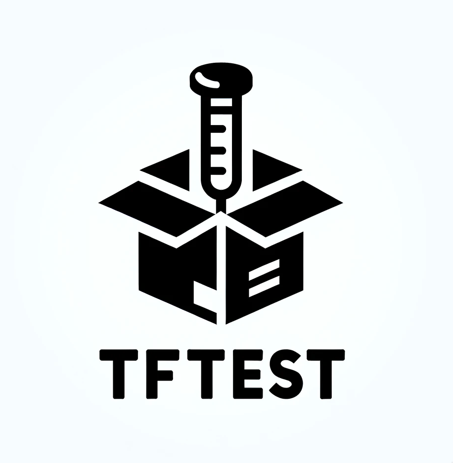

<h1 align="center">
  <br/>
</h1>
<p align="center">A collection of functions and common patterns to test <a href="https://www.terraform.io/">Terraform</a> code using <a href="https://golang.org/">Go</a>, and <a href="https://terratest.gruntwork.io">Terratest</a>.<br/><br/>


---

## Installation 🛠️

Install it using [Go get](https://golang.org/cmd/go/#hdr-Add_dependencies_to_current_module_and_install_them):

```bash
go get github.com/Excoriate/tftest
```

### Pre-requisites 📋

- [Go](https://golang.org/doc/install) >= 1.18

>**NOTE**: For the tools used in this project, please check the [Makefile](./Makefile), and the [Taskfile](./Taskfile.yml) files. You'll also need [pre-commit](https://pre-commit.com/) installed.

---


## Usage 🚀

```go

```

---

## Roadmap 🗓️

- [ ] Add more tests
- [ ] Add a set of pre-defined error messages

>**Note**: This is still work in progress, however, I'll be happy to receive any feedback or contribution. Ensure you've read the [contributing guide](./CONTRIBUTING.md) before doing so.


## Contributing

Please read our [contributing guide](./CONTRIBUTING.md).
